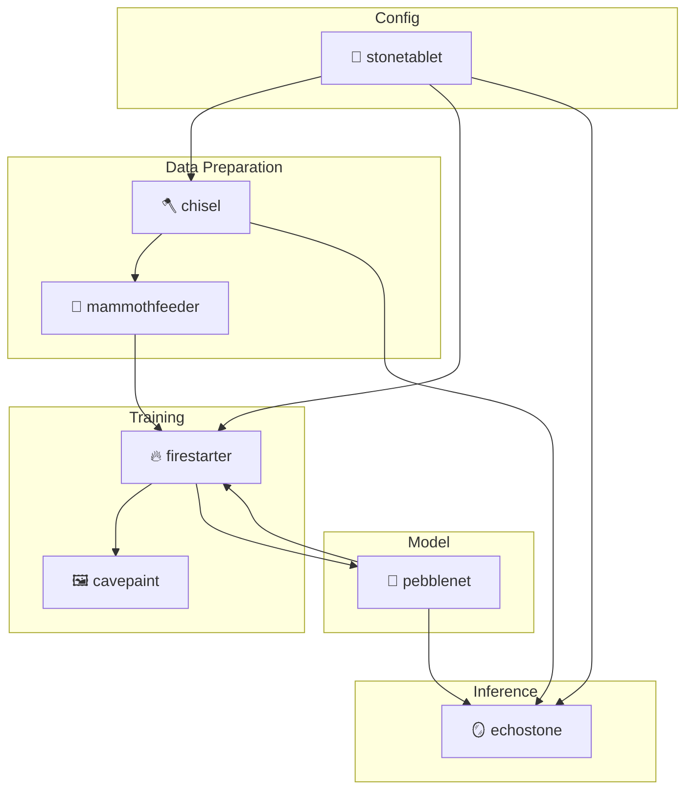

```mermaid
flowchart TD
    subgraph Config
        ST[📜 stonetablet]
    end

    subgraph Data Preparation
        CH[🪓 chisel]
        MF[🦣 mammothfeeder]
    end

    subgraph Model
        PN[🧠 pebblenet]
    end

    subgraph Training
        FS[🔥 firestarter]
        CP[🖼️ cavepaint]
    end

    subgraph Inference
        ES[🪞 echostone]
    end

    ST --> CH
    CH --> MF
    ST --> FS
    MF --> FS
    PN --> FS
    FS --> CP
    FS --> PN
    ST --> ES
    CH --> ES
    PN --> ES
```
